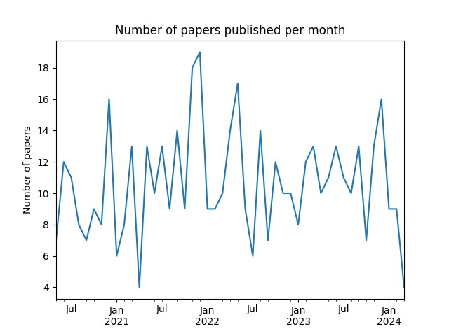
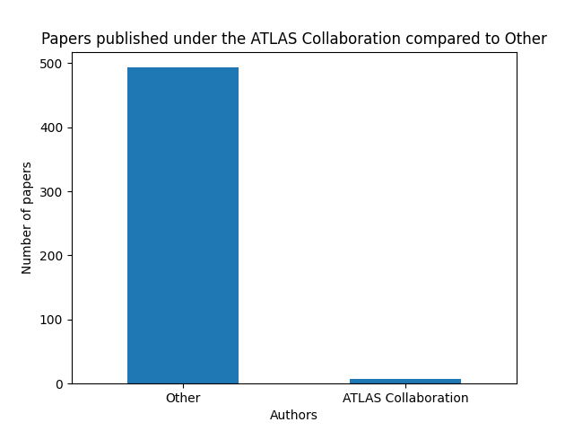
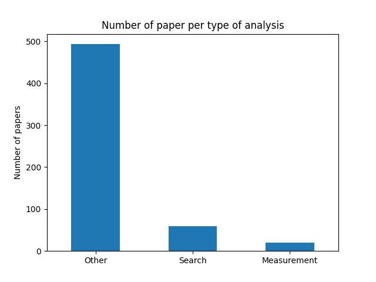
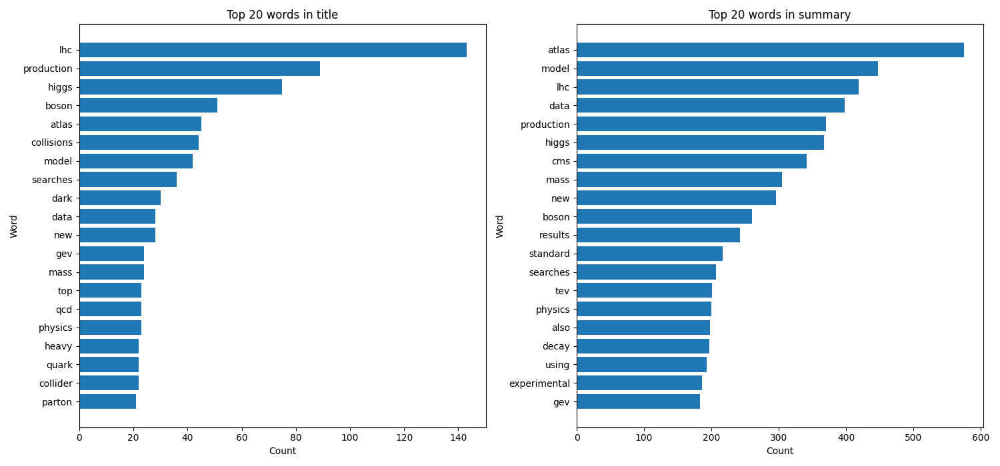
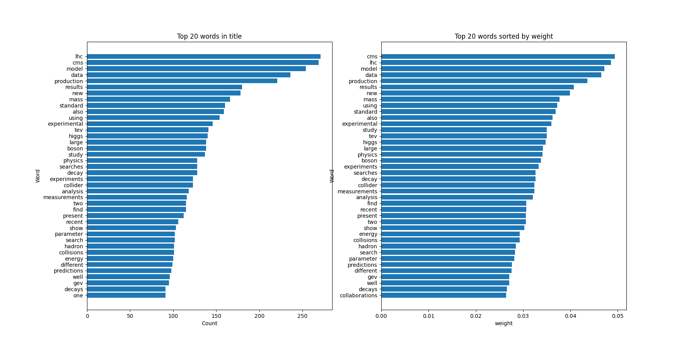

# HEP-ArXiv-Articles

This project is dedicated to analysing ghe articles published to ArXiv for the High Energy Physics (HEP) and the ATLAS experiment.

The analysis includes:

- Reading and processing the last 500 published articles, using metadata such as title, summary, and authors.
- Extracting and analyzing the metadata, to ensure its accuracy and quality.
- Process the data from the articles and store them in a PostgreSQL database (locally), which allows for efficient querying and data analysis.
- Performing text analysis on the articles' summaries and titles.
- Using machine learning techniques to classify the articles based on their content.

This project aims to provide insights into the current research trends in High Energy Physics and the ATLAS experiment, and to demonstrate how data science techniques can be applied to analyse and classify the large sets of academic articles.


## Getting Started

These instructions will help setup the enviroment needed to run the code

This project uses Python 3. You can check your Python version with the following command:

```bash
python --version
```
The packages that are needed to run the code, you can install them running the following:

```bash
pip3 install -r requirements.txt
```
Environement variables need to be created to connect to PostgreSQL, specifying the user and the password:
```bash
export POSTGRES_USER="postgres"
export POSTGRES_PW="xxxxxxx"
```

## Structure

This project has the following structure:

- `src/`: This directory contains all the code for the project.
  - `PapersExtraction.py`: This script handles the extraction of Arxiv data and performing analysis to check the accuracy of the data.
  - `PostgresConnection.py`: This script contains functions to connect to PostgreSQL database and query/write tables 
  - `DataPreparation.py`: This script reads the postgres table, then process and structure the data 
  - `WordsOccurences.py`: This scripts allows to performce analysis on the occurencies in the articles' summaries and titles
  - `ModelPrediction.py`: This scripts contains machine learning model training, and applies the model to make predictions.
- `plots/`: This directory contains all resulting plots
- `requirements.txt`: This file lists the dependencies that need to be installed.
- `README.md`: This file provides an overview of the project.

## Project Details

This project focuses on the analysis of the most recent 500 papers published on ArXiv for High Energy Physics (HEP) and ATLAS experiment. The project's execution follows the same sequence as outlined in the `Structure` section.

### Extracting the papers
The ArXiv API is used to fetch the metadata of these papers (speciying the number of articles, the descending order of publishing and the category and the query `cat:hep-ph+AND+all:ATLAS`). The resuls include details of the articles, where the the title, summary, authors, and dates of published and updated are kept for this analysis.

Once the data is fetched, it is stored in a Pandas DataFrame for further processing and analysis. This DataFrame provides a convenient and efficient way to manipulate the data.

Various plots are made to visualize the data and their quality:
- First the number of published papers per month is checked

- Then since the papers published under the name of the whole ATLAS collaboration indicate it as the author name, the number of the articles with `ATLAS Collaborartion` are check vs the res (published by one team)

- Last since there are different results analysis, the articles with `search` and `measurement` are compared with respect to the rest. 


After the analysis, the data along with the results are stored in a PostgreSQL database, to be easily used across this project.

### Data preparation
As of now the data is stored as unstructered and uncleaned.

This part is responsible for preparing the data for analysis. This is done by reading the data from the postgres table, removing unnecessary information, cleaning the data (remove puctuation, use only lower case, ...).
Then to prepare the data to be stored properly, the articles are indexed which is useful to join the tables later.
, and the lists from within a single DataFrame column  are transformed into separate rows with single words. This is particularly useful to perform words analysis later. 
Then data is stored into 3 different tables (title, summary and authors), with a common key `paperidentifier`.

- The part to connect, read and write is handled in `PostgresConnection.py` 

### words analysis with NLP techniques
The focus of this part is to analyse the data by checking the most occured (count) of words in the title and the summary.

First it it reads the data from the seperate PostgreSQL tables for titles and summaries just created.
The frequency of each word in the titles and summaries. It does this from the tokanised text data which is already stored into individual words and then counting the occurrences of each word.
The frequency of the top 20 words in the title and summary are compared.



### Machine Learning training and accuracy
In this final part, machine learning model sare used to classify the article into a category, using the title and the summary.

First the most common/occuring words are checked, using the PostgreSQL tables and joining the title and summry into one field.
The words counts are calculated by the `CountVectorizer` from the `sklearn.feature_extraction.text` library. 
The 40 most common words are extracted with theirs weights using (`TfidfTransformer`). Would be also nice to point out here the similarity of the top words with respect to the results from the previous part.


In the last part, and based on the results just obtained, a column is added to the dataframe called "Category".
This is done by taking the list of the 40 common words, removing words sush as "data", "lhc", "also",.. and keeping only words that reflects a category of classification. The "Category" will hold only words out of the list, chosen if it is exists in eithe the title or the summary (and the most common in case several words from the list exist in the title and summary).
The list of Tagreted words are : `['model', 'production', 'results', 'mass', 'standard', 'experimental', 'higgs', 'large', 'boson', 'study', 'searches', 'decay', 'experiments', 'analysis', 'measurements', 'find', 'present', 'recent', 'show', 'parameter', 'search', 'hadron', 'collisions', 'energy', 'different', 'predictions', 'well', 'decays']`
For example, if an article has the words `production, results and collisions` in its title or summary, the category will be `production`.

Then two ML models (supervided) are considered, (using 80% of the data for training and 20% for testing) to predict the category in which an article can be classified. 
The two considered models are:
- KNeighborsClassifier: for predicting a categorical label based on the nearest neighbours
  In this model `n_neighbors=2` is used. 
- LogisticRegression: makes predictions based on a logistic function, works well for to predict binary classes

The `LogisticRegression model achieved an accuracy of 60%`, which is higher than the accuracy of the `KNeighborsClassifier which is 50%`.

The accuracy of the models was evaluated using the test data. It showed to be lower than the testing accuracy in both cases. Since the model performs well on the `training data (accuracy of 77%)` but poorly on the test data, it is a sign of overfitting.

There are many ways to investigate and improve the results, such as increasing the data statistics (now only using 500 articles, can use more), hyper parameters optimisation (now using standard parameters), consider other models more dedicated for this project.   
 


